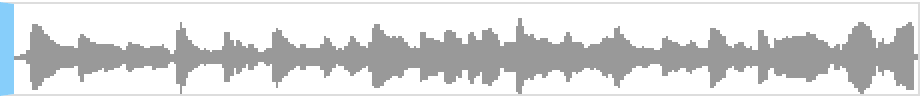

<link rel='stylesheet' href='https://raw.githubusercontent.com/jasonm23/markdown-css-themes/gh-pages/avenir-white.css'>
<style>
  body {
    padding-bottom: 60px;
  }
</style>
#Drawing Audio Waveforms

Working on [scat.io](http://scat.io) I ran into the interesting issue of rendering audio waveforms on screen. This is a walkthrough of my trial-and-error method of figuring out a good way to accomplish that.

##The data

We receive the audio data in the form of a typed array, like:

    [ 0, 0.0253245, 0.0452343, ... ]

So far so good, except that the length of the array is 44100 * secondLength

###Boiling it down

So let's boil that down. We don't reasonably need more data than we can display on the screen. In other words, we only need an array of values with length equal to the number of pixels along the x-axis.

```javascript
function boil( data, pixels ) {
  var pixelLength = Math.round(data.length/pixels);
  var vals = [];

  // For each pixel we display
  for (var i = 0; i < pixels; i++) {
    var posSum = 0,
      negSum = 0;

    // Cycle through the data-points relevant to the pixel
    for (var j = 0; j < pixelLength; j++) {
      var val = data[ i * pixelLength + j ];

      // Keep track of positive and negative values separately
      if (val > 0) {
        posSum += val;
      } else {
        negSum += val;
      }
    }
    vals.push( [ negSum / pixelLength, posSum / pixelLength ] );
  }
  return vals;
}
```

##Rendering

Now let's use our <code>boil</code> function along with d3 to draw the waveform:

```javascript
function render(data, containerEl) {
  // Vertical scale
  var multiplier = 500;

  d3.select( containerEl )
    .selectAll('div')
    // boil down the large array into a 100px result
    .data( boil( data, 100 ) )
    .enter()
    .append('div')

    // Height should be the sum of the negative and positive values
    .style('height', function( point ) {
      var sum = point[1] - point[0];
      return sum * multiplier + 'px';
    })

    // Distance from top should be the height of the positive value
    .style('margin-top'), function( point ) {
      return -point[1] * multiplier + 'px';
    });
}
```

##Results

Incorporating this logic into my <code>RegionView</code>, here's what pops out:

<center>

</center>

Looks pretty darn good to me!

##Further considerations

###Scaling

The biggest problem with the above is that we're cycling through the entire audio data array, which may be many million datapoints long.

Luckily, regardless of the input array size, the information we want to render is only as large as the number of pixels we want to display it on. So, for longer clips, we can throw out most of the data:

```javascript
function boil( data, pixels ) {
  var pixelLength = Math.round(data.length/pixels);
  var vals = [];

  // 1000 datapoints / second
  var sampleEvery = 44;

  // For each pixel we display
  for (var i = 0; i < pixels; i++) {
    var posSum = 0,
      negSum = 0;

    // Cycle through the data-points relevant to the pixel
    for (var j = 0; j < pixelLength; j++) {
      var index = i * pixelLength + j;
      if ( index % sampleEvery !== 0 ) {
        continue;
      var val = data[ index ];

      // Keep track of positive and negative values separately
      if (val > 0) {
        posSum += val;
      } else {
        negSum += val;
      }
    }
    vals.push( [ negSum * sampleEvery / pixelLength, posSum * sampleEvery / pixelLength ] );
  }
  return vals;
}
```
